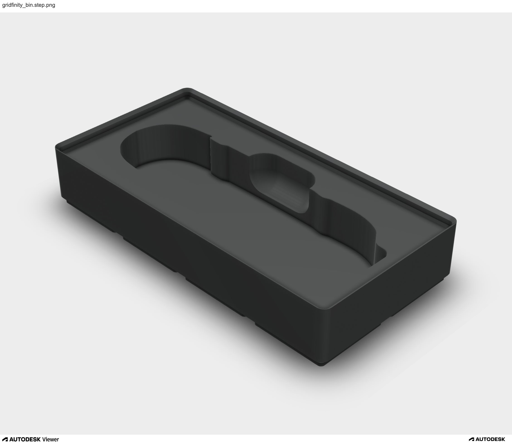

# tooltrace-inverter

A Python script that converts a Gridfinity bin with a tool negative (generated on [Tooltrace](https://tooltrace.ai))
into a tool model positive.

The resulting tool model can then be imported into [Gridfinity Generator](https://gridfinitygenerator.com) to create
bins with magnet support, a feature that Tooltrace does not currently provide.

## License

Copyright © 2026 Andrew M. Zhang  
All rights reserved.

## Input/Output Example

| Input: Tooltrace Bin W/ Cutout              | Output: Tool Model                  |
|---------------------------------------------|-------------------------------------|
|  |  |


## Python Workflow

1. Generate a Gridfinity bin with a tool negative using [Tooltrace](https://tooltrace.ai)
2. Download the Tooltrace bin as a STEP file
3. Run this script to invert the tool negative into a tool positive model
   1. `python main.py gridfinity_bin.step tool_model.stl`
4. Open [Gridfinity Generator](https://gridfinitygenerator.com) -> Cutout -> General -> Browse -> `tool_model.stl`

## How to compile C++ into WASM

### Using cmake

```shell
mkdir build && cd build
emcmake cmake ..         # Use CMake version ~4.2.0
emmake make -j8          # Produces `index.wasm` `index.js`, and `index.html` in the build directory
cp ../gridfinity_bin.step.png ../tool_model.stl.png ../worker.js ./build/ # Copy some assets into ./build
python -m http.server    # Use this command to serve the page
```

### Without cmake

You'll need to compile OCCT for emscripten.
```shell
git clone https://github.com/Open-Cascade-SAS/OCCT.git
cd OCCT
mkdir build-emc
cd build-emc
emcmake cmake -DBUILD_LIBRARY_TYPE=static -DBUILD_MODULE_Draw=OFF -DUSE_FREETYPE=OFF ..
emmake make -j8
```
Compile `main.cpp` and use `shell.html` to create the webpage
```shell
emcc --shell-file shell.html \
  -I/path/to/OCCT/build-emc/include/opencascade \
  -L/path/to/OCCT/build-emc/lin32/clang/lib \
  -lTKernel \
  -lTKMath \
  -lTKG2d \
  -lTKG3d \
  -lTKGeomBase \
  -lTKBRep \
  -lTKGeomAlgo \
  -lTKTopAlgo \
  -lTKPrim \
  -lTKBool \
  -lTKShHealing \
  -lTKXSBase \
  -lTKDESTL \
  -lTKBO \
  -lTKDESTEP \
  -lTKMESH \
  -std=c++20 \
  -sEXPORTED_FUNCTIONS=_malloc,_free \
  -sEXPORTED_RUNTIME_METHODS=stringToUTF8,UTF8ToString,lengthBytesUTF8 \
  -sALLOW_MEMORY_GROWTH \
  -sNO_DISABLE_EXCEPTION_CATCHING \
  -sMODULARIZE=1 \
  -sWASM=1 \
  main.cpp -o index.html
```

This compilation should produce `index.wasm`, `index.js`, and `index.html`. Webpage can be served via:
```shell
python -m http.server
```
